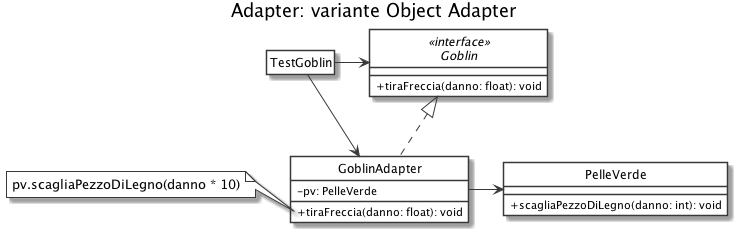
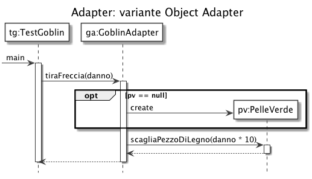
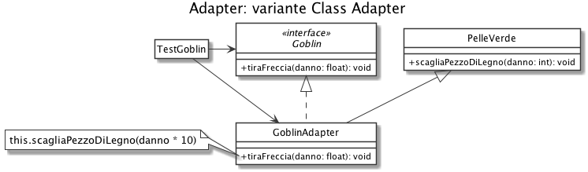
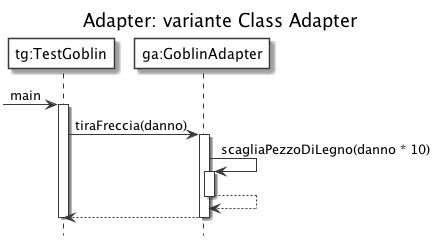

# Adapter: un Goblin per un PelleVerde

Abbiamo una classe *PelleVerde* che espone un metodo con firma e range di valori ammessi diversi da quelli attesi dal client, il quale usa invece l'interfaccia *Goblin*.

Vogliamo adattare la classe *PelleVerde* all'interfaccia *Goblin*, aggiungendo inoltre la validazione dell'input, non precedentemente prevista in *PelleVerde*.

## Variante Object Adapter

Ci permette di implementare un meccanismo *Lazy Initialization* per l'istanza di *PelleVerde*.

## Variante Class Adapter

Ci permette di implementare un *Adapter a due vie*, ovvero in grado di fornire sia i metodi previsti da *Goblin* che da *PelleVerde*.

