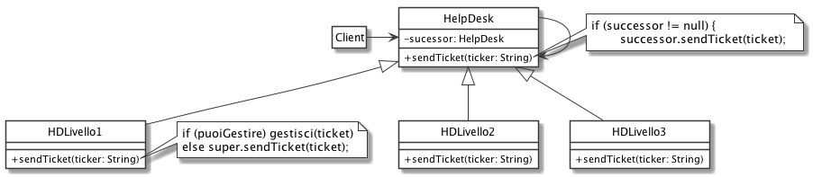

# Chain of responsibility: Help Desk Magazzino Amatron

Vogliamo implementare un sistema di help desk per un magazzino della multinazionale Amatron. Ci sono tre livelli di Help Desk, legati a 3 piani diversi di servizio:

- livello 1 (base): risolve problemi legati al funzionamento delle stampanti;
- livello 2 (business): risolve problemi legati al funzionamento dei server;
- livello 3 (premium): risolve problemi legati al funzionamento dei robot;

Ogni ticket viene prima inviato al livello 1, per poi passare (se compreso nel piano) all'hd del livello successivo nel caso in cui il ticket non sia stato ancora risolto.

# Soluzione

