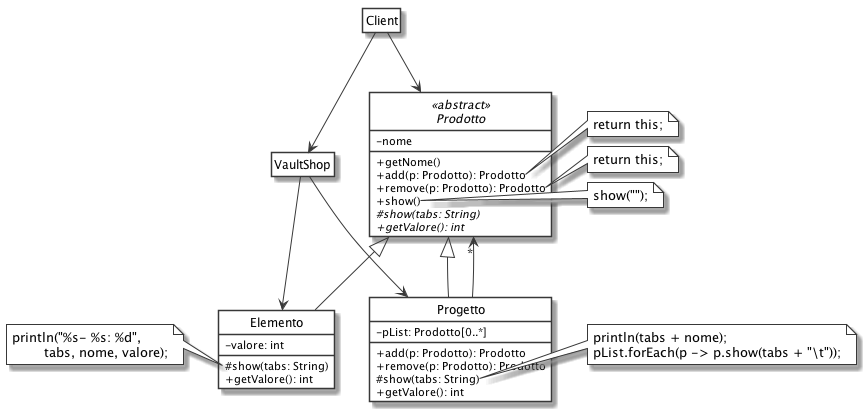

# Composite: VaultShop

In un passato alternativo, negli anni '50 la guerra fredda è finita nel più tragico dei modi: le due chiavi dorate sono state girate, il bottone rosso è stato premuto, e la bomba atomica è stata sganciata, distruggendo tutto. Solo alcune piccole e fortunate comunità riuscirono a salvarsi in tempo all'interno di bunker anti atomici (detti Vault). Il concetto di valuta è cambiato, ora i tappi di bottiglia sono il nuovo denaro, e anche la qualità dei prodotti venduti negli shop in giro per il vault non è delle migliori.

Vogliamo realizzare un sistema per la gestione di un VaultShop, un negozio dove vengono venduti prodotti di ogni tipo, assemblando alla meno peggio tutto ciò che il tempo e le radiazioni non sono riusciti a disintegrare.

Ogni Prodotto è una composizione di Elementi base (copertoni, ferri vecchi, parti elettriche...) e Progetti (buggy, computer, spara talpe...), dove un progetto può essere a sua volta composto da altri progetti o elementi.

Per ogni prodotto deve essere possibile visualizzare la lista completa delle sue parti e ottenere il calcolo del valore totale (ovviamente in tappi). Ad esempio:

```bash
Progetto: buggy autonoma
        Progetto: buggy
                - copertoni: vale 30 tappi
                - ferri vecchi: vale 20 tappi
        - parti elettriche: vale 50 tappi
Valore Totale: 100 tappi

Progetto: buggy scontata
        Progetto: buggy
                - ferri vecchi: vale 20 tappi
Valore Totale: 20 tappi
```

## Soluzione

