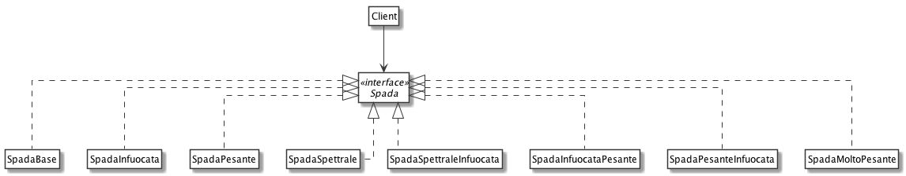

# Decorator: Spada Incantata

Vogliamo creare un Empoprio in cui comprare spade incantate. Ogni incantesimo può influire sul danno infilitto da una spada base, e sulla lista di effetti:

- Spada Base: nessun incantesimo
- Spada Infuocata: danno * 2, aggiunge effetto "ustione"
- Spada Spettrale: aggiunge effetto "paura"
- Spada Pesante: +5 al danno

Ad una spada posso applicare più incantesmi:

- Spada Spettrale Infuocata: danno x2, effetti "ustione" e "paura"
- Spada Infuocata Pesante: (danno + 5) * 2, effetto "ustione"
- Spada Pesante Infuocata: (danno * 2) + 5, effetto "usione"
- Spada Molto Pesante: danno + 10

## Senza design pattern Decorator

## Con design pattern Decorator

