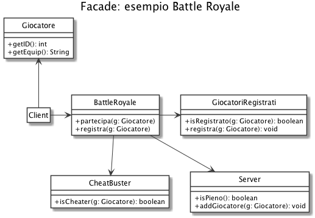
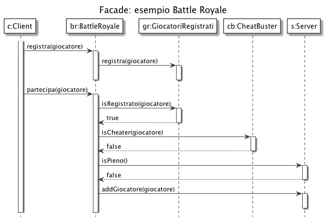

# Facade: Battle Royale

Vogliamo realizzare un gioco online chiamato (con molta fantasia) *Battle Royale*. Il sistema è composto da diverse parti:

- un servizio per mantenere la lista dei giocatori registrati, e quindi autorizzati ad accedere al gioco;
- un servizio per contrastare i cheater, negando l'accesso a giocatori che usano equipaggiamenti non consentiti;
- il server di gioco vero e proprio, caratterizzato da una lista di giocatori online e da una capienza limitata.

Vogliamo creare un componente di interfaccia per il client in modo da semplifare le operazioni di registrazione e accesso al gioco, mascherando i componenti di cui il sottosistema è composto.

