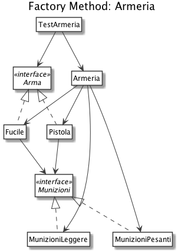

# Factory Method - variante con Dependency Injection: Armeria

Supponiamo di dover sviluppare un gioco FPS in cui il giocatore può interagire con un'armeria per recuperare l'arma con cui iniziare la partita.

Possono essere fornite varie armi (es. fucile e pistola) ognuna delle quali è caratterizzata da una quantità di danno diversa in base al tipo di attacco (danno ad area, danno colpo mirato).

Le armi possono essere equipaggiate con due diverse tipologie di munizioni: pesanti e leggere. Le munizioni pesanti forniscono un moltiplicatore di danno maggiorato rispetto a quelle leggere.

# Diagramma UML delle classi

