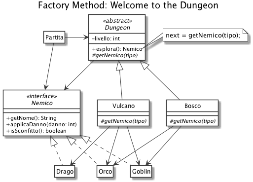

# Factory Method: Welcome to the Dungeon

Supponiamo di dover sviluppare un gioco in cui il giocatore può affrontare dei dungeon popolati da diverse tipologie di nemici (es. goblin, orchi, draghi). 

Durante ogni partita, il giocatore può decidere che tipo di dungeon affrontare (es. Bosco, Vulcano) e il numero di attacchi a sua disposizione per superare tutti i livelli di cui è composto (ogni attacco infligge un numero casuale di danni tra 1 e 10).

Tutti i dungeon, a prescindere dal tipo, sono composti da 4 livelli da esplorare, in ognuno dei quali è presente un nemico da sconfiggere di una determinata categoria: 

- un nemico *normale* nel primo e nel secondo livello;
- un nemico *elite* nel terzo livello;
- un *boss* nel quarto e ultimo livello.

Il tipo di nemico associato alla categoria può variare al variare del dungeon, ad esempio:

Dungeon Bosco:

- *Normale*: Goblin
- *Elite*: Goblin
- *Boss*: Orco

Dungeon Vulcano:

- *Normale*: Goblin
- *Elite*: Orco
- *Boss*: Goblin

Ogni nemico regisce in maniera diversa ai danni:

- Goblin: 5 punti ferita iniziali, ogni danno inflitto vale doppio;
- Orco: 10 punti ferita iniziali;
- Drago: ucciso solo con un colpo da almeno 10 danni.

Nota: in futuro deve essere possibile aggiungere facilmente nuovi tipi di dungeon e nuovi tipi di nemici.

## Soluzione


## Esempio output

```bash
# Avvio partita nel Bosco con 10 attacchi
- Infliggo 6 danni a: Goblin
- Goblin sconfitto!
- Infliggo 5 danni a: Goblin
- Goblin sconfitto!
- Infliggo 7 danni a: Goblin
- Goblin sconfitto!
- Infliggo 5 danni a: Orco
- Infliggo 7 danni a: Orco
- Orco sconfitto!
Vittoria

# Avvio partita nel Vulcano con 10 attacchi
- Infliggo 4 danni a: Goblin
- Goblin sconfitto!
- Infliggo 2 danni a: Goblin
- Infliggo 9 danni a: Goblin
- Goblin sconfitto!
- Infliggo 9 danni a: Orco
- Infliggo 1 danni a: Orco
- Orco sconfitto!
- Infliggo 5 danni a: Drago
- Infliggo 4 danni a: Drago
- Infliggo 2 danni a: Drago
- Infliggo 1 danni a: Drago
- Infliggo 8 danni a: Drago
Sconfitta
```
