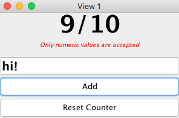
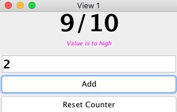
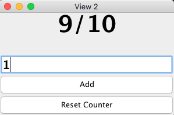
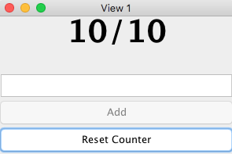
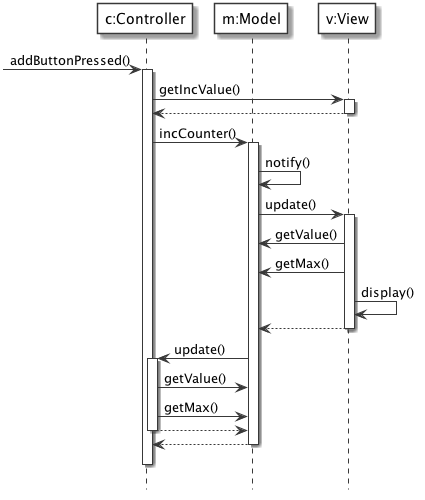

# MVC: Contatore

E’ considerato un pattern architetturale per le applicazioni interattive. Individua tre componenti: *Model* per funzionalità principali e dati; *View* per mostrare i dati; *Controller* per prendere gli input dell’utente.

## Responsabilità

Model:

- fornisce le funzionalità principali e i dati dell'applicazione
- è indipendente dalla rappresentazione dei dati e degli input
- notifica View e Controller dei cambiamenti ai dati

View:

- mostra i dati all'utente
- generalmente ci sono tante View e ad ogni View è associato un Controller
- implementa la procedura di update
- mostra i dati che legge dal Model

Controller:

- riceve gli input dall'utente sotto forma di eventi (es. mouse e tastiera)
- traduce gli eventi in richieste di servizio per il Model o in richieste di visualizzazione per la View
- implementa la procedura di update, se necessario

## Implementazione

Essendo un patter architetturale, MVC fornisce delle indicazioni generali sui ruoli dei componenti e sulle loro relazioni, ma lascia al programmatore il compito di prendere le scelte di design di più basso livello.

Ad esempio, nell'MVC è importante notificare tempestivamente la View e, se necessario, il Controller sul cambiamento del Model. Per risolvere questo problema, può essere usato il design patter *Observer*.

Il Controller potrebbe dover cambiare il suo comportamento in base allo stato del Model o in base alla sequenza di interazioni precedenti con l'utente: in questo caso, può essere usato il design pattern *State*.

L'interfaccia grafica potrebbe essere composta da più View elementari combinate tra loro. Queste all'occorrenza possono essere raggruppate e organizzate in maniera differente. In questo caso, può essere usato il design pattern *Composite*.

Esiste una variante in cui Controller viene usato come *Mediator* tra la View e il Model: tutti gli aggiornamenti di stato vengono notificati solo al Controller, che si occuperà di innescare, quando necessario, l'aggiornamento della View.

MVC è implementato da molti framework per la gestione di interfacce interattive. A seconda dell'ambiente (es. desktop, mobile o web) certe interazioni tra Model, View e Controller potrebbero essere implementate in maniera diversa.

Inoltre il framework di visualizzazione usato potrebbe già aver preso scelte di design che possono facilitare o ostacolare l'implementazione di MVC.

## Esempio di implementazione

In questa implementazione è stato usato il design pattern Observer per notificare sia la View che il Controller sui cambiamenti di stato nel Model.

La View viene notificata per poter aggiornare la visualizzazione dei dati.

Il Controller, può registrarsi, ad esempio, per abilitare o disabilitare alcune funzionalità disponibili nella View.

## Funzionalità

- La GUI è composta da due finestre identiche, ognuna delle quali deve visualizzare il valore attuale di un contatore e fornire le funzionalità di incremento e di reset del contatore. Il contatore ha un valore massimo.
- L'utente può inserire solo valori numerici positivi; in caso di problemi con il formato dell'input, deve essere visualizzato un messaggio di errore.
- Non deve essere possibile aggiungere un valore al contatore che causarebbe il superamento del valore massimo (es: non è possibile aggiungere 2 se il contatore è già a 9); in guesto caso, deve essere visualizzato un messaggio di warning.
- Se il contatore ha già raggiunto il valore massimo, la funzionalità di incremento deve essere disabilitata.

	
  	 
  	
	

## Diagramma delle Classi

## Diagramma di Sequenza

