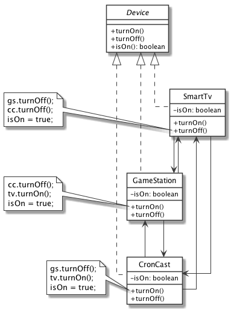
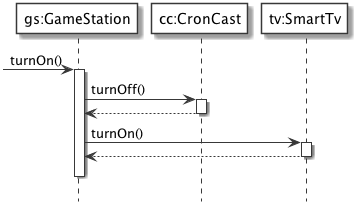
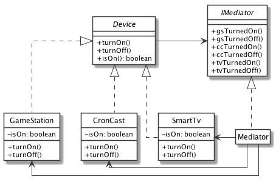
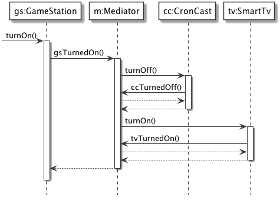

# Mediator: SmartTv

Nel nostro sistema abbiamo tre dispositivi diversi connessi tra loro: una SmartTv, una GameStation e un CronCast. L'accensione o lo spegnimento di uno può provocare l'accensione o lo spegnimento di un altro, nello specifico:

- accendere la GameStation o il CronCast causa anche l'accensione della SmartTv;

- accendere la GameStation causa lo spegnimento del CronCast, e viceversa;

- lo spegnimento della SmartTv causa lo spegnimento della GameStation e del CronCast.

## Senza Mediator
Avremmo due problemi:

- ogni device deve conoscere gli altri due;

- la logica di accensione/spegnimento degli altri device è sparsa tra più classi:
 	- comportamento globale difficile da comprendere;
 	- comportamento globale difficile da modificare.

## Con Mediator
Con un Mediator, abbiamo risolto due problemi:

 - ogni device conosce solo il Mediator (è il mediator a conoscere tutti);
 
 - la logica di accensione/spegnimento globale è ora nel mediator:
 	- ogni colleague incarica il mediator di avvisare gli altri colleague;
 	- il comportamento globale è più facile da modificare o sostituire, agendo sul mediator.

