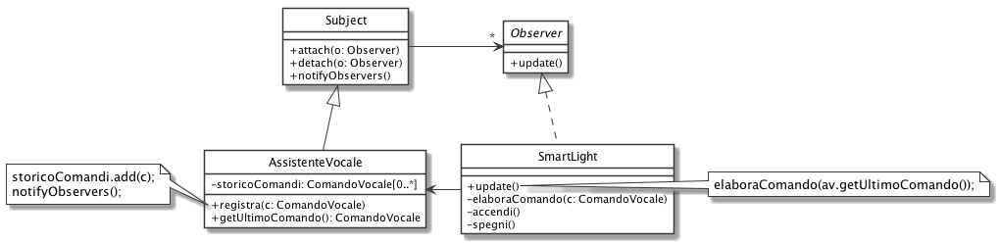
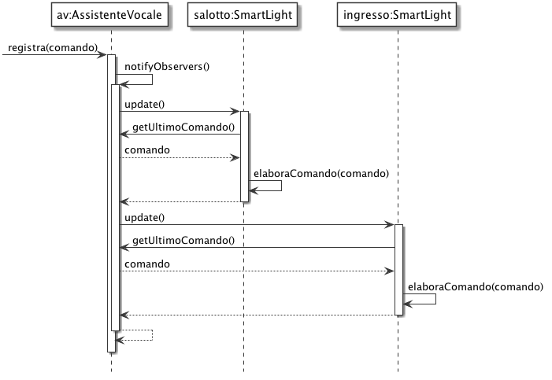
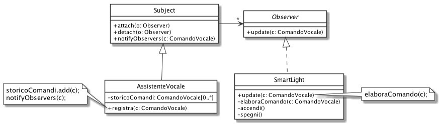
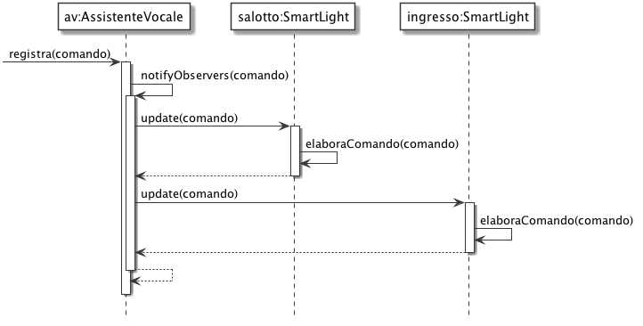

# Observer: SmartLight

Vogliamo realizzare un *Assistente Vocale* in grado di registrare comandi per accendere e spegnere le luci intelligenti (*Smart Light*) della casa.

## Variante Pull

## Variante Push

