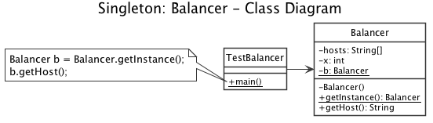
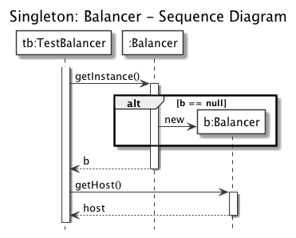

# Singleton: Load Balancer

Vogliamo implementare un servizio di load balancing client side, ovvero in grado di distribuire equamente il carico di richieste ad una lista di host predefiniti, fornendo ai client un metodo per ottenere ad ogni richiesta un host differente (es. il successivo in una lista ciclica).

