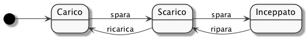
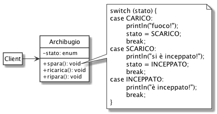
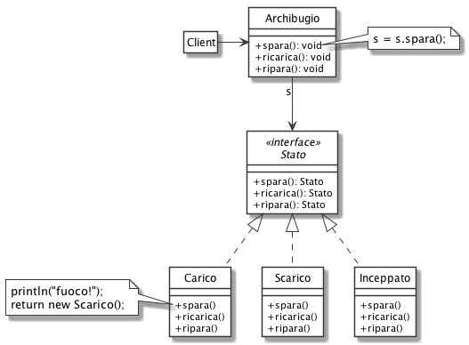

# State: Archibugio

Vogliamo implementare il comportamento di un archibugio antico, descritto dal seguente diagramma UML degli stati:

## Senza design pattern State

## Con design pattern State

