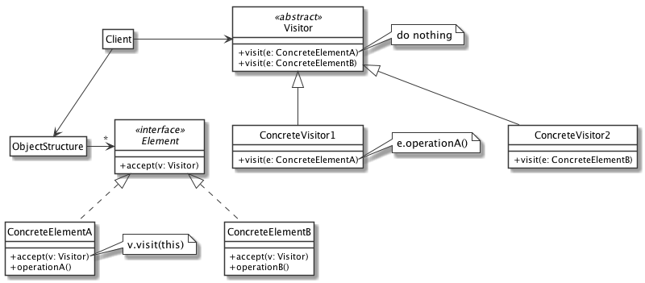
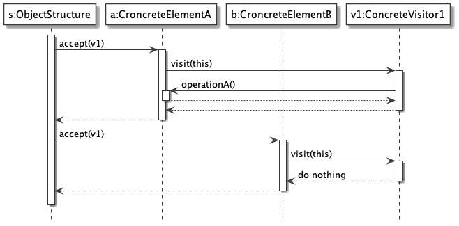
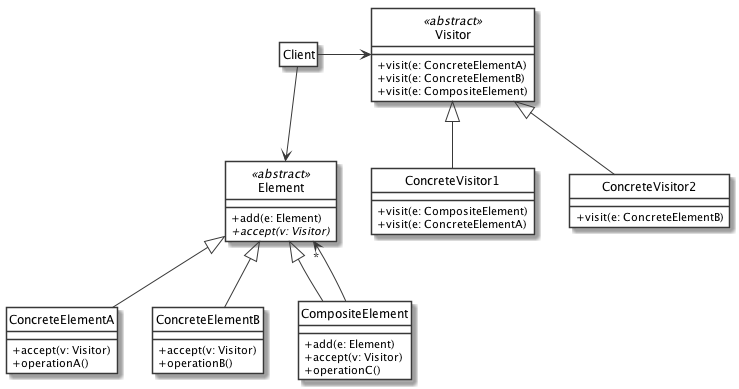

# Visitor

**Nota:** non è oggetto d'esame

Visitor consente la definizione di nuove operazioni su un oggetto composito senza modificare la struttura di oggetti su cui opera.

Usato dai compilatori per eseguire operazioni di analisi sull'albero della sintassi di un programma (*Abstract Syntax Tree*).

La struttura da analizzare (*ObjectStructure*) può essere una semplice lista di *Element* o può assumere una struttura più complessa, ad albero, usando il design pattern *Composite*.

## Diagramma delle classi

## Diagramma di sequenza

## Utilizzo assieme al Composite

